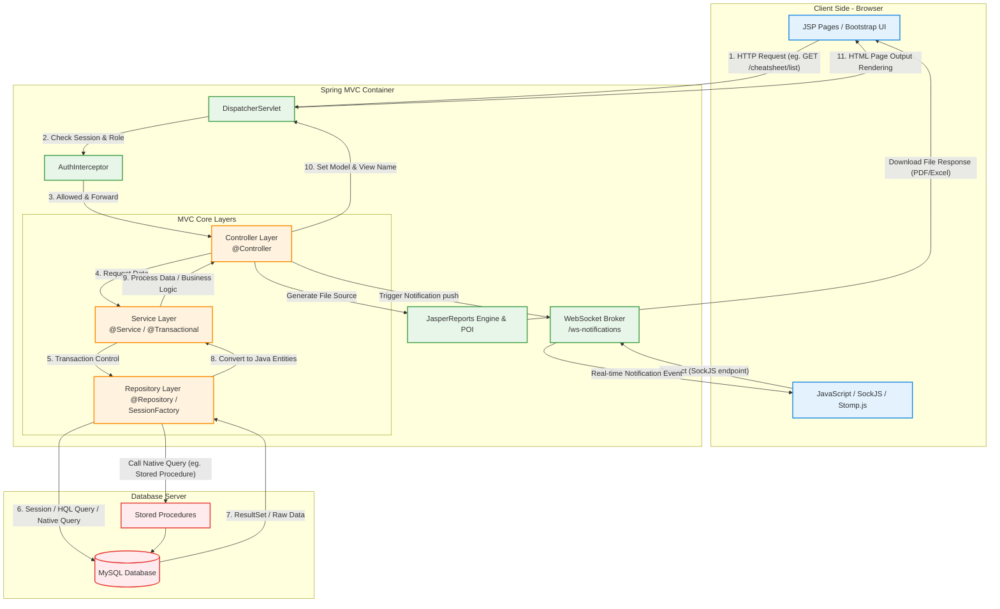

# CheatSheet_Hibernate Learning Project - Code Flow & Architecture Explanation

ဤစာမျက်နှာသည် **CheatSheet_Hibernate** Project ၏ **Code Flow (ကုဒ်အလုပ်လုပ်ပုံအဆင့်ဆင့်)**၊ **Architecture (ဗိသုကာပုံစံ)** နှင့် အသုံးပြုထားသော **Technology** များအကြောင်းကို လေ့လာသူ နားလည်လွယ်စေရန် အသေးစိတ် ရှင်းပြထားခြင်း ဖြစ်သည်။

---

## ၁။ Architecture & Directory Structure (စနစ်တည်ဆောက်ပုံ)

ဤ Project သည် လုပ်ငန်းခွင်သုံး **3-Tier Layered Architecture** (Controller -> Service -> Repository -> Database) ကို အခြေခံထားပြီး **MVC (Model-View-Controller)** Pattern ကို အသုံးပြုထားသည်။

### Directory ဖွဲ့စည်းပုံနှင့် တာဝန်များ:
* **`com.hibernate.config`**: Spring & WebSocket configurations များဖြစ်ပြီး Database, SessionFactory နှင့် WebSocket Endpoints များကို Setup လုပ်ပေးသည်။
  * [AppConfig.java](file:///c:/Users/DELL/eclipse-workspace/CheatSheet_Hibernate/src/main/java/com/hibernate/config/AppConfig.java) (Spring context နှင့် Hibernate setting များ)
  * [WebSocketConfig.java](file:///c:/Users/DELL/eclipse-workspace/CheatSheet_Hibernate/src/main/java/com/hibernate/config/WebSocketConfig.java) (Real-time Message Broker settings)
* **`com.hibernate.controller`**: User ထံမှ Request များကို လက်ခံပြီး သက်ဆိုင်ရာ Service များသို့ လွှဲပြောင်းပေးသည်။ View (JSP) သို့မဟုတ် Response Data များကို ပြန်ပို့ပေးသည်။
* **`com.hibernate.service`**: Business Logic (စီးပွားရေးဆိုင်ရာ စည်းမျဉ်းများ) များကို ကိုင်တွယ်ပြီး Transaction စီမံခန့်ခွဲမှု (`@Transactional`) ကို လုပ်ဆောင်သည်။
* **`com.hibernate.repository`**: Database နှင့် တိုက်ရိုက်ထိတွေ့ပြီး Hibernate Session ကိုသုံးကာ Data CRUD (Create, Read, Update, Delete) လုပ်ငန်းများကို ဆောင်ရွက်သည်။
* **`com.hibernate.entity`**: Database Table များနှင့် ချိတ်ဆက်ထားသော Java Object (ORM Model) များဖြစ်သည်။
* **`com.hibernate.interceptor`**: User သည် Login ဝင်ထားခြင်း ရှိမရှိနှင့် Admin Router ဖြစ်ပါက Admin Role ဟုတ်မဟုတ် စစ်ဆေးပေးသော Filter Layer ဖြစ်သည်။
  * [AuthInterceptor.java](file:///c:/Users/DELL/eclipse-workspace/CheatSheet_Hibernate/src/main/java/com/hibernate/interceptor/AuthInterceptor.java)
* **`src/main/webapp/WEB-INF/views`**: User တွေ့မြင်ရမည့် Frontend Page (JSP) များဖြစ်သည်။

---

## ၂။ နှိုင်းယှဉ်ချက်နှင့် နည်းပညာများ၏ အခန်းကဏ္ဍ (Technology Stack)

| နည်းပညာ (Technology) | ဘာအတွက်သုံးတာလဲ (Purpose) | ဘယ်နေရာတွေမှာ သုံးထားလဲ (Usage in Project) |
| :--- | :--- | :--- |
| **Spring MVC** | Request Routing များနှင့် Controller/View များကို စီမံခန့်ခွဲရန် | URL mappings မျာဖြစ်သည့် `/cheatsheet/*`, `/auth/*`, `/profile` စသည်တို့တွင် Request လက်ခံရန်နှင့် JSP render ဖတ်ရန်။ |
| **Hibernate (ORM)** | Java Object များနှင့် SQL database အား mapping လုပ်၍ Data ကို ကိုင်တွယ်ရန် | [entity](file:///c:/Users/DELL/eclipse-workspace/CheatSheet_Hibernate/src/main/java/com/hibernate/entity/) အောက်ရှိ Entity ဖိုင်များအားလုံးနှင့် Repository Layer ၏ Database Actions များတွင် သုံးသည်။ |
| **Spring Transaction** | Database စာရင်းများ သိမ်းဆည်းရာတွင် အမှားအယွင်းရှိပါက အားလုံးကို Rollback လုပ်ရန် | Service implementations (`*ServiceImpl.java`) များတွင် `@Transactional` annotation ဖြင့် သုံးသည်။ |
| **Spring WebSocket (STOMP)** | Real-time (refresh လုပ်ရန်မလိုဘဲ) Data/Notification များကို Server မှ Client သို့ တွန်းပို့ပေးရန် | User များ Like ပေးခြင်း၊ Comment ရေးခြင်း၊ Share လုပ်ခြင်းတို့ ပြုလုပ်ပါက တစ်ဖက်လူဆီ real-time notification ပို့ရန် [NotificationSocketService](file:///c:/Users/DELL/eclipse-workspace/CheatSheet_Hibernate/src/main/java/com/hibernate/websocket/NotificationSocketService.java) နှင့် [header.jsp](file:///c:/Users/DELL/eclipse-workspace/CheatSheet_Hibernate/src/main/webapp/WEB-INF/views/header.jsp#L430) တွင် သုံးသည်။ |
| **JasperReports** | Database အချက်အလက်များမှတစ်ဆင့် စာရင်းဇယား PDF report ထုတ်ရန် | Admin Controller ဖြစ်သော [ReportExportController.java](file:///c:/Users/DELL/eclipse-workspace/CheatSheet_Hibernate/src/main/java/com/hibernate/controller/ReportExportController.java) တွင် PDF compile/fill/export ရန် သုံးသည်။ |
| **Apache POI** | Database စာရင်းများကို Excel format ဖြင့် Export ထုတ်ရန် | Admin list မှ Data များကို Excel file အဖြစ် download ချနိုင်ရန် `JRXlsxExporter` ဖြင့် တွဲဖက်သုံးသည်။ |
| **jBCrypt** | User password များကို Hash လုပ်၍ Database တွင် လုံခြုံစွာ သိမ်းဆည်းရန် | [UserServiceImpl.java](file:///c:/Users/DELL/eclipse-workspace/CheatSheet_Hibernate/src/main/java/com/hibernate/service/UserServiceImpl.java) တွင် Register သို့မဟုတ် Password change ချိန်တွင် Hash လုပ်ရန် သုံးသည်။ |
| **Lombok** | Boilerplate code (Getter/Setter/Constructor) များကို လျှော့ချရန် | Java Entity နှင့် Service/Controller များတွင် `@Getter`, `@Setter`, `@RequiredArgsConstructor` Annotation များဖြင့် သုံးသည်။ |
| **JSP & JSTL** | Server-side rendering frontend views ဖန်တီးရန် | [views](file:///c:/Users/DELL/eclipse-workspace/CheatSheet_Hibernate/src/main/webapp/WEB-INF/views/) folder အောက်ရှိ `.jsp` ဖိုင်များတွင် HTML များနှင့် `<c:forEach>`, `<c:if>` tag များတွဲဖက်သုံးသည်။ |

---

## ၃။ Code Flow Visual Diagram (Mermaid)

ဤ Diagram သည် User တစ်ဦးမှ HTTP Request ပို့လိုက်ချိန်မှစ၍ Database ဆီသို့ သွားရောက်ကာ ဒေတာများ ပြန်လည် ဖော်ပြပေးပုံနှင့် WebSocket ဆက်သွယ်ပုံကို ဖော်ပြထားသည်။

---

## ၄။ အဆင့်ဆင့် လုပ်ငန်းစဉ် ရှင်းလင်းချက် (Step-by-Step Flow Explanation)

### က။ HTTP Request & View Rendering Flow (ဥပမာ- CheatSheet List ကြည့်ရှုခြင်း)
1. **User Request**: User က Browser မှတစ်ဆင့် `/cheatsheet/list` သို့ ဝင်ရောက်သည်။
2. **Dispatcher Servlet**: Web Container ထဲရှိ `DispatcherServlet` (Spring ၏ Center Entry) မှ ၎င်း Request ကို ဖမ်းယူသည်။
3. **Interceptor Check**: Request သည် [AuthInterceptor](file:///c:/Users/DELL/eclipse-workspace/CheatSheet_Hibernate/src/main/java/com/hibernate/interceptor/AuthInterceptor.java) ကို ဖြတ်သန်းရသည်။ User Session မရှိလျှင် `/login` သို့ Redirect လုပ်ပြီး၊ Session ရှိပါက ဆက်သွားခွင့်ပြုသည်။
4. **Controller Action**: `DispatcherServlet` သည် Request ကို [CheatsheetController](file:///c:/Users/DELL/eclipse-workspace/CheatSheet_Hibernate/src/main/java/com/hibernate/controller/CheatsheetController.java) ၏ `list()` method ဆီသို့ ပို့ပေးသည်။
5. **Service Layer**: Controller မှတစ်ဆင့် `cheatsheetService.findByUserId()` ကို လှမ်းခေါ်သည်။ Service တွင် `@Transactional` ကြောင့် Database Connection/Transaction စတင်ပွင့်သွားသည်။
6. **Repository Layer (Hibernate Session)**: Service မှတစ်ဆင့် [CheatsheetRepositoryImpl](file:///c:/Users/DELL/eclipse-workspace/CheatSheet_Hibernate/src/main/java/com/hibernate/repository/CheatsheetRepositoryImpl.java) ၏ SessionFactory မှ `getSession().createQuery()` ကို သုံးကာ Database သို့ HQL query (ဥပမာ- `select distinct c from CheatsheetEntity c ...`) ဖြင့် ဒေတာ လှမ်းတောင်းသည်။
7. **Database Output**: MySQL Database က Query အတိုင်း ရှာဖွေပြီး Data ပြန်ပေးသည်။ Hibernate က ၎င်း Data များကို Java Object (`CheatsheetEntity`) များအဖြစ် ပြောင်းလဲ (ORM Map) ပေးသည်။
8. **Return & Rendering**: Service မှတစ်ဆင့် Controller သို့ List ပြန်ရောက်လာသည်။ Controller က `ModelAndView("mycheatsheet", "cheatsheetlist", mySheets)` ကို DispatcherServlet ဆီ ပြန်ပေးကာ `mycheatsheet.jsp` တွင် dynamic list အဖြစ် Render လုပ်၍ User ဆီ ပြသသည်။

---

### ခ။ Real-time WebSocket Notification Flow (ဥပမာ- Like / Comment လုပ်လျှင် Alert တက်ခြင်း)
1. **Connection Setup**: Client ဘက်မှ Page စတင်ပွင့်ချိန်တွင် `header.jsp` ရှိ `SockJS` ဖြင့် `/ws-notifications` ဆီသို့ WebSocket Stomp Client ကို ချိတ်ဆက်ထားသည်။ ပြီးနောက် `/topic/notifications/{currentUserId}` လမ်းကြောင်းကို Subscribe (စောင့်ကြည့်) လုပ်ထားသည်။
2. **Event Trigger**: User A က User B ၏ CheatSheet တွင် Like သို့မဟုတ် Comment ပေးလိုက်သည်။
3. **Database & Service Notification**: သက်ဆိုင်ရာ Controller မှတစ်ဆင့် [NotificationService](file:///c:/Users/DELL/eclipse-workspace/CheatSheet_Hibernate/src/main/java/com/hibernate/service/NotificationServiceImpl.java) ၏ `createNotification()` ကို ခေါ်သည်။ ၎င်းက Database တွင် Notification Entity ကို သွားရောက်သိမ်းဆည်းသည်။
4. **Socket Push**: Service က [NotificationSocketService](file:///c:/Users/DELL/eclipse-workspace/CheatSheet_Hibernate/src/main/java/com/hibernate/websocket/NotificationSocketService.java) ကို သုံးပြီး `/topic/notifications/{targetUserId}` သို့ ဒေတာ (Notification JSON) ကို Push လုပ်လိုက်သည်။
5. **Real-time Alert**: WebSocket server မှတဆင့် User B ၏ browser သို့ Event ဒေတာ ချက်ချင်းရောက်သွားသည်။ Browser ၏ JavaScript မှ ၎င်း JSON ကို ဖတ်ယူပြီး SweetAlert2 သို့မဟုတ် Toast alert ဖြင့် စာမျက်နှာ refresh လုပ်ရန်မလိုဘဲ တိုက်ရိုက်ပြသပေးသည်။

---

### ဂ။ Export Report Flow (ဥပမာ- PDF/Excel ထုတ်ယူခြင်း)
1. **Admin Request**: Admin User က `/admin/reports/cheatsheet/pdf` ကဲ့သို့ စာမျက်နှာကို နှိပ်လိုက်သည်။
2. **Controller Compilation**: [ReportExportController](file:///c:/Users/DELL/eclipse-workspace/CheatSheet_Hibernate/src/main/java/com/hibernate/controller/ReportExportController.java) မှ Database ရှိ data စာရင်းကို ဆွဲထုတ်သည်။
3. **Jasper compilation**: JRBeanCollectionDataSource ဖြင့် Java Object List ကို ဒေတာရင်းမြစ်အဖြစ် သတ်မှတ်ပြီး Jasper file တွင် Compile လုပ်သည်။
4. **Browser Output**: Controller မှ `response.setContentType("application/pdf")` ဖြင့် Header သတ်မှတ်ပြီး output stream ထဲသို့ ဒေတာများကို ပို့ပေးကာ PDF/Excel file အဖြစ် တိုက်ရိုက် download ကျလာစေသည်။

---

ဤရှင်းလင်းချက်သည် သင်၏ Learning project တွင် အသုံးပြုထားသော အဓိက Flow များနှင့် နည်းပညာများကို လွယ်ကူစွာ သဘောပေါက်စေရန် အထောက်အကူပြုလိမ့်မည်ဟု မျှော်လင့်ပါသည်။
